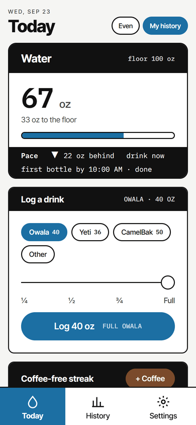
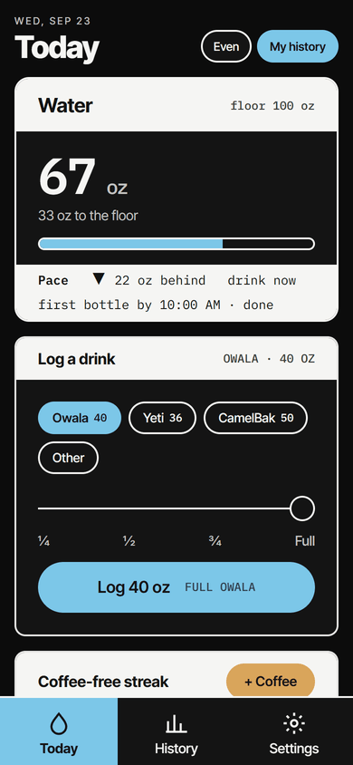
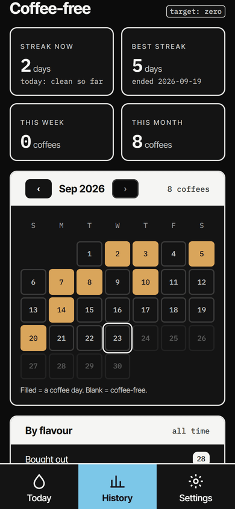
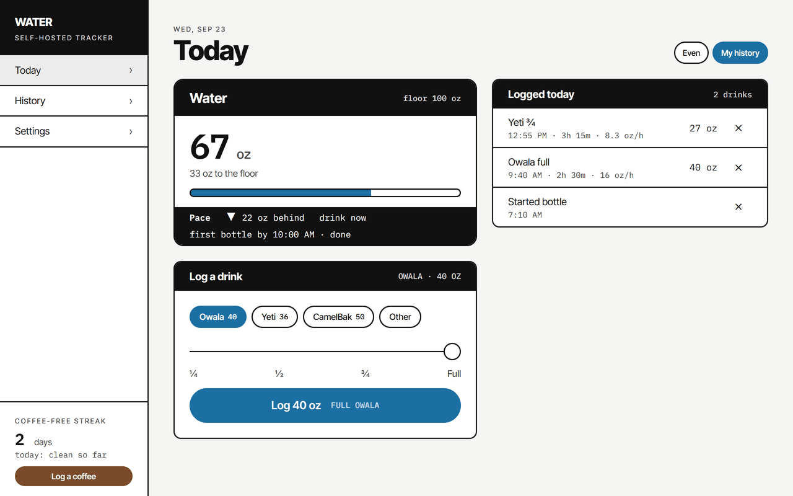

# Water Tracker

A small, self-hosted daily water tracker. Phone + desktop web app (installable from the browser),
Docker on your own machine, Postgres for data. Built one feature at a time as a learning project;
the process is documented in [CONTRIBUTING.md](CONTRIBUTING.md).

<p>
  
  
  
</p>

What it does:

- **Log a drink in one tap.** Pick your bottle, slide ¼ / ½ / ¾ / Full, Log. Or type a one-off amount;
  recent amounts come back as chips.
- **Today against a daily floor** (100 oz by default), with **pace**: ahead or behind, next drink due, and a
  first-bottle checkpoint. Two pace modes: an even spread, or a curve learned from your own cleared days.
- **Bottle timing.** Each finished bottle shows how long it took and ounces per hour; an optional
  "Started bottle" tap times the first one of the day.
- **Coffee, target zero.** A coffee-free streak, a brew timer from pour to finished, flavours, and a
  coffee calendar.
- **History.** Streaks, 7 / 30 day and 13 week charts, a month calendar, week / month / quarter tables,
  first-drink-vs-floor and bottle-pace breakdowns.
- **Make it yours.** Bottles, daily floor, oz or mL, pace window, coffee flavours and a colour theme,
  saved on your server.
- **Installable and offline-first.** Add it to your home screen over HTTPS; it opens with no signal, and
  taps land locally and sync when the server is reachable.



Screenshots use generated demo data. Release notes: [CHANGELOG.md](CHANGELOG.md).

## Run it

Requirements: [Bun](https://bun.sh), Docker, a PostgreSQL you can reach.

```bash
git clone https://github.com/rrhinog/water-tracker.git
cd water-tracker
bun install
cp .env.example .env            # fill in POSTGRES_PASSWORD and DATABASE_URL
```

Create the database and tables (the schema is hand-written SQL in `drizzle/`, applied in order;
each file runs once):

```bash
psql "$DATABASE_URL_WITHOUT_DB" -c "CREATE DATABASE water_tracker;"
for f in drizzle/*.sql; do psql "$DATABASE_URL" -v ON_ERROR_STOP=1 -f "$f"; done
```

Develop:

```bash
bun run dev      # http://localhost:3000
bun run test     # vitest
bun run lint
bun run build
```

Deploy with Docker (two containers from one image — `live` on :4210 and `staging` on :4211 — so a branch
can be tried on a phone before it reaches `main`):

```powershell
.\scripts\deploy.ps1 staging   # build + recreate + probe
.\scripts\deploy.ps1 live      # refuses unless you are on main
```

`docker-compose.yml` binds to `127.0.0.1` only. To reach the app from a phone, add your LAN or
Tailscale address in a `docker-compose.override.yml` (gitignored):

```yaml
services:
  live:
    ports: ["127.0.0.1:4210:4210", "YOUR.ADDRESS:4210:4210"]
  staging:
    ports: ["127.0.0.1:4211:4211", "YOUR.ADDRESS:4211:4211"]
```

and set `PHONE_HOST=YOUR.ADDRESS` in `.env` so the deploy script prints the phone URL. Then open it in
Safari or Chrome and Add to Home Screen.

### HTTPS (installable app, opens offline)

Browsers only run the service worker that lets the app open with no signal on a secure origin. With
[Tailscale](https://tailscale.com) (HTTPS certificates enabled for your tailnet), serve both containers
privately on your tailnet:

```bash
tailscale serve --bg --https=8445 http://127.0.0.1:4210   # live
tailscale serve --bg --https=8446 http://127.0.0.1:4211   # staging
```

Set `TS_HTTPS_HOST=yourpc.your-tailnet.ts.net` in `.env` and the deploy script prints the HTTPS URL.
Add to Home Screen from that URL. A new origin starts with an empty local cache; your data is on
the server, so nothing is lost, but open the old app once first so anything it logged offline is sent.

## Make it yours

Everything personal lives in **Settings** (the gear on the main screen): your containers and their
sizes, the daily floor, oz or mL, the pace window and default pace mode. First run starts with the
author's defaults; change them once and every device follows. The "my history" pace curve is built
from your own cleared days once you have ten; a built-in curve stands in before that.

## Stack

Next.js (App Router) · TypeScript · Tailwind · Drizzle + `pg` · vitest · Docker (standalone output).

## License

MIT — see [LICENSE](LICENSE).
